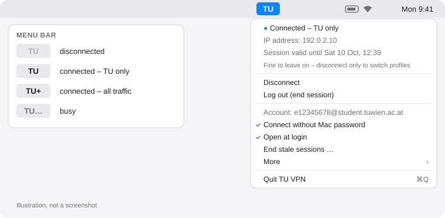

<div align="center">


# TU VPN for macOS

**One click in the menu bar – and you're on the TU Wien network.**<br>
A lean menu bar app for TUvpn, no Cisco Secure Client needed.

[](https://github.com/hannokuegler/tu_vpn/releases/latest)
[](https://github.com/hannokuegler/tu_vpn/actions/workflows/ci.yml)
[](LICENSE)


[Deutsch](README.md) · **English**

</div>

```bash
curl -fsSL https://raw.githubusercontent.com/hannokuegler/tu_vpn/main/install.sh | bash
```

<sub>One Terminal command: checks macOS, installs openconnect via Homebrew if needed, downloads the latest version, verifies its SHA-256 checksum and launches the app. Other options: [Installation](#installation).</sub>

<p align="center">
  <picture>
    <source media="(prefers-color-scheme: dark)" srcset="docs/menu-en-dark.svg">
    
  </picture>
</p>

> [!NOTE]
> Unofficial student project – not made or endorsed by TU Wien. Official information: [TU's TUvpn guides](https://colab.tuwien.ac.at/spaces/SVCSP/pages/141888133/Anleitungen+TUvpn).

## Features

- 🔌 **One click** to connect and disconnect, right in the menu bar
- 🔑 **MFA only once per session** – a TU session lasts about 5 days, after that one click is enough
- 🌍 **Two profiles**: TU traffic only, or all traffic (for library papers)
- 🔒 **Network password and session in the macOS Keychain**, never in plain text
- 💤 **Survives sleep and Wi-Fi changes** – openconnect reconnects on its own
- 🙅 **Optionally without your Mac password** – set up once, no more admin prompts
- 💬 **Clear error messages** with the next step (password, MFA, session limit, no network …)
- 🇦🇹🇬🇧 **German and English**, following your system language
- 🪶 One small app (Swift/AppKit), Apple Silicon and Intel, using the free client [openconnect](https://www.infradead.org/openconnect/)

## How it works

1. **Install** – paste the command above into Terminal.
2. **Enter your login** – on first launch: `e` + matriculation number (e.g. `e12345678`); staff use their full address.
3. **Connect** – click **TU** at the top right → *Connect – TU only*. Enter your network password, MFA code and, once, your Mac password. Done.

The menu bar then shows the state: bold **TU** = connected, faint **TU** = disconnected, **TU+** = all traffic tunneled, **TU…** = busy.

> [!TIP]
> “TU only” can stay on all day or all week – it costs nothing and only affects TU addresses. You really only need **Disconnect** to switch profiles.

## Requirements

- **macOS 13 (Ventura) or newer**, Apple Silicon or Intel
- **TU network account activated** and **MFA set up** – [TU guide](https://colab.tuwien.ac.at/x/OITjBw). Note: the *network password* is not your TISS password.
- **Homebrew** for openconnect – the installer offers to set it up if missing

## Profiles

| Menu item | TU profile | What goes through the tunnel | When |
|---|---|---|---|
| **Connect – TU only** | `1_TU_getunnelt` | only traffic to the TU network | default: TISS, TUWEL, servers, licenses |
| **Connect – All traffic** | `2_Alles_getunnelt` | all traffic | library papers and e-journals that are unlocked only for TU addresses |

TU asks you to use “all traffic” only when needed and to switch back to “TU only” afterwards. To switch: **Log out (end session)**, then connect with the other profile.

| Menu item | Effect |
|---|---|
| **Disconnect** | closes the tunnel, the session stays open on the server – reconnect without password and MFA |
| **Log out (end session)** | ends the session on the server – needed before switching profiles |
| **End stale sessions …** | opens the [TU portal](https://nix.kom.tuwien.ac.at/vpn-sessions) – max. 3 simultaneous sessions per account |
| **More → Forget login data …** | removes login, password and sessions from the Keychain |

Quitting the app keeps a running connection up.

## Without your Mac password (optional)

Connecting and disconnecting need root, because openconnect reconfigures the network. By default macOS asks for your Mac password each time. Your Mac password has nothing to do with the TU session – that one lasts ~5 days anyway.

If you'd rather not be asked: menu → **Connect without Mac password** → *Set up*, enter your Mac password once, done. TU VPN then creates

- a **root-owned copy** of openconnect and its libraries in `/Library/TUvpn/` (your user can't modify it), and
- a **sudo rule** `/etc/sudoers.d/tuvpn` that allows *only your user* exactly four commands without a password: connect with one of the two profiles, disconnect, log out.

To remove it: the same menu item or `uninstall.sh`. After `brew upgrade openconnect` the app suggests setting it up again. Why this is safe enough (and where its limits are): [SECURITY.md](SECURITY.md).

## Installation

**Recommended – one command:**

```bash
curl -fsSL https://raw.githubusercontent.com/hannokuegler/tu_vpn/main/install.sh | bash
```

<details>
<summary><b>Manually from the releases</b></summary>

1. `brew install openconnect`
2. Download `TUvpn-macOS.zip` from the [latest release](https://github.com/hannokuegler/tu_vpn/releases/latest), unzip, drag **TU VPN** into *Applications*.
3. Optional check: compare `shasum -a 256 TUvpn-macOS.zip` with `SHA256SUMS`, or verify the CI provenance with the GitHub CLI:
   `gh attestation verify TUvpn-macOS.zip --repo hannokuegler/tu_vpn`
4. On first launch macOS blocks the app because it is not notarized by Apple (that costs $99/year). To open it anyway:
   - Open the app once → close the message → **System Settings → Privacy & Security** → at the bottom **“Open Anyway”** → confirm with your Mac password.
   - Or in Terminal: `xattr -dr com.apple.quarantine "/Applications/TU VPN.app"`

The one-line installer doesn't need this step: files downloaded with `curl` get no quarantine flag, and the installer verifies the checksum instead.
</details>

<details>
<summary><b>Build from source</b></summary>

Needs only the Xcode Command Line Tools (`xcode-select --install`), no Xcode project:

```bash
git clone https://github.com/hannokuegler/tu_vpn.git && cd tu_vpn
./build.sh test       # tests
./build.sh --install  # build, copy to /Applications, launch
```
</details>

## FAQ & troubleshooting

<details>
<summary><b>“Network password rejected” – but the password is right?</b></summary>

Almost always the TISS password was saved instead of the **network password**. Click *Re-enter password* in the error dialog. If the network password is definitely right, check that your network account is activated and MFA is set up ([guide](https://colab.tuwien.ac.at/x/OITjBw)). The TU server reports a non-activated account the same way as a wrong password.
</details>

<details>
<summary><b>“MFA code rejected”</b></summary>

The code was wrong or already expired. Wait for the next code and click *Try again*. The app tells a wrong password from a wrong code by whether the server asked for the code at all.
</details>

<details>
<summary><b>“Too many open VPN sessions”</b></summary>

Each account may have at most 3 sessions at once – phones and other devices count too. Menu → *End stale sessions …* opens the TU portal; end old sessions there.
</details>

<details>
<summary><b>Do I have to enter my Mac password every time?</b></summary>

Only when connecting and disconnecting, not for the TU session. “TU only” can simply stay on, overnight and through sleep. If you never want to be asked: [Without your Mac password](#without-your-mac-password-optional).
</details>

<details>
<summary><b>What happens on sleep or a Wi-Fi change?</b></summary>

openconnect notices the broken connection and rebuilds the tunnel with the existing session by itself – no password, MFA or admin prompt. TU VPN starts openconnect with `--reconnect-timeout 86400` for this: it keeps trying for up to 24 hours (the default would be 5 minutes). If the TU session expired in the meantime, openconnect gives up, the menu bar shows a faint **TU** again and you get a notification.

To be honest: this relies on openconnect's built-in reconnect logic; a long-term test across many sleep cycles is still pending for v0.1.0. Please share your experience as an [issue](https://github.com/hannokuegler/tu_vpn/issues).

With **“all traffic”**, all your traffic waits for the tunnel while a reconnect is in progress. On hotel or train Wi-Fi with a login page, **Disconnect** first, log in there, then reconnect.
</details>

<details>
<summary><b>The app says “No internet connection” or “server not responding”</b></summary>

Before asking for password and MFA, TU VPN briefly checks that `vpn.tuwien.ac.at` is reachable. Without network, with an open Wi-Fi login page or on networks that block VPN you get this message – log in via the browser or try another network (e.g. a phone hotspot).
</details>

<details>
<summary><b>After an update the Keychain asks for access</b></summary>

Expected: the app isn't notarized, so macOS doesn't recognize the new version as the same app. Click *Always Allow* once.
</details>

<details>
<summary><b>Where are the logs?</b></summary>

- Sign-in: `~/Library/Logs/TUvpn-auth.log` (readable only by you)
- Tunnel: `/var/log/tuvpn.log`

Both are also in the menu under *More*. Password, MFA code and session cookie are never in any log. Still, take a quick look before attaching one to a [bug report](https://github.com/hannokuegler/tu_vpn/issues/new/choose).
</details>

<details>
<summary><b>I can't find the app</b></summary>

TU VPN has no window and no Dock icon; it lives in the menu bar at the top right as **TU**. If your menu bar is very full it may hide behind the camera notch – remove other menu bar icons or ⌘-drag them. Double-clicking the app in *Applications* opens its menu.
</details>

## Security

In short: password and session live only in the macOS Keychain, secrets never go through command-line arguments, everything that runs as root is strictly validated first, and logs live in root-owned locations. Release builds are made in GitHub Actions, with a checksum and signed provenance. Threat model, known limits and how to report issues: **[SECURITY.md](SECURITY.md)**.

## Uninstall

```bash
curl -fsSL https://raw.githubusercontent.com/hannokuegler/tu_vpn/main/uninstall.sh | bash
```

Removes the app, open-at-login, Keychain items, settings, logs and – if set up – the passwordless mode (asks for your Mac password for that). openconnect stays installed (`brew uninstall openconnect`).

## Contributing

Bugs and ideas welcome as an [issue](https://github.com/hannokuegler/tu_vpn/issues/new/choose), code as a pull request – see [CONTRIBUTING.md](CONTRIBUTING.md). Changes: [CHANGELOG.md](CHANGELOG.md).

## Disclaimer

Unofficial project by students, not affiliated with TU Wien. “TU Wien” is mentioned only to describe which service the app talks to; no TU logos or trademarks are used. Use at your own risk, without warranty ([MIT License](LICENSE)). TU Wien's terms of use for TUvpn apply.
