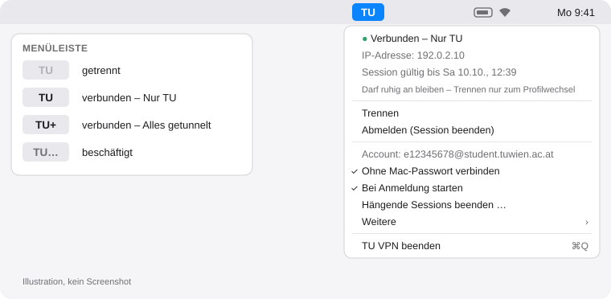

<div align="center">


# TU VPN für macOS

**Ein Klick in der Menüleiste – und du bist im Netz der TU Wien.**<br>
Schlanke Menüleisten-App fürs TUvpn, ohne Cisco Secure Client.

[](https://github.com/hannokuegler/tu_vpn/releases/latest)
[](https://github.com/hannokuegler/tu_vpn/actions/workflows/ci.yml)
[](LICENSE)


**Deutsch** · [English](README.en.md)

</div>

```bash
curl -fsSL https://raw.githubusercontent.com/hannokuegler/tu_vpn/main/install.sh | bash
```

<sub>Ein Befehl im Terminal: prüft macOS, installiert bei Bedarf openconnect über Homebrew, lädt die neueste Version, prüft die SHA-256-Prüfsumme und startet die App. Andere Wege: [Installation](#installation).</sub>

<p align="center">
  <picture>
    <source media="(prefers-color-scheme: dark)" srcset="docs/menu-de-dark.svg">
    
  </picture>
</p>

> [!NOTE]
> Inoffizielles Studi-Projekt – nicht von der TU Wien und nicht von ihr unterstützt. Offizielle Infos: [TUvpn-Anleitungen der TU](https://colab.tuwien.ac.at/spaces/SVCSP/pages/141888133/Anleitungen+TUvpn).

## Was die App kann

- 🔌 **Ein Klick** zum Verbinden und Trennen, direkt in der Menüleiste
- 🔑 **MFA nur einmal pro Session** – die TU-Session gilt rund 5 Tage, danach reicht ein Klick
- 🌍 **Zwei Profile**: nur TU-Verkehr oder alles getunnelt (für Bibliotheks-Paper)
- 🔒 **Netzwerkpasswort und Session im macOS-Schlüsselbund**, nie im Klartext
- 💤 **Übersteht Ruhezustand und WLAN-Wechsel** – openconnect verbindet sich selbst neu
- 🙅 **Optional ohne Mac-Passwort** – einmal einrichten, danach kein Admin-Dialog mehr
- 💬 **Verständliche Fehlermeldungen** mit dem nächsten Schritt (Passwort, MFA, Session-Limit, kein Netz …)
- 🇦🇹🇬🇧 **Deutsch und Englisch**, je nach Systemsprache
- 🪶 Eine kleine App (Swift/AppKit), Apple Silicon und Intel, freier Client [openconnect](https://www.infradead.org/openconnect/)

## So funktioniert's

1. **Installieren** – den Befehl oben ins Terminal kopieren.
2. **Login eingeben** – beim ersten Start: `e` + Matrikelnummer (z. B. `e12345678`), Mitarbeiter_innen die volle Adresse.
3. **Verbinden** – oben rechts auf **TU** klicken → *Verbinden – Nur TU*. Netzwerkpasswort, MFA-Code und einmal das Mac-Passwort eingeben. Fertig.

Danach zeigt die Menüleiste den Zustand: **TU** kräftig = verbunden, **TU** blass = getrennt, **TU+** = alles getunnelt, **TU…** = gerade beschäftigt.

> [!TIP]
> „Nur TU“ darf ruhig den ganzen Tag oder die ganze Woche an bleiben – es kostet nichts und betrifft nur TU-Adressen. **Trennen** brauchst du eigentlich nur, um das Profil zu wechseln.

## Voraussetzungen

- **macOS 13 (Ventura) oder neuer**, Apple Silicon oder Intel
- **TU-Netzwerk-Account aktiviert** und **MFA eingerichtet** – [TU-Anleitung](https://colab.tuwien.ac.at/x/OITjBw). Wichtig: Das *Netzwerkpasswort* ist nicht das TISS-Passwort.
- **Homebrew** für openconnect – der Installer bietet es an, falls es fehlt

## Profile

| Menüpunkt | TU-Profil | Was durch den Tunnel geht | Wann |
|---|---|---|---|
| **Verbinden – Nur TU** | `1_TU_getunnelt` | nur Verkehr ins TU-Netz | Standard: TISS, TUWEL, Server, Lizenzen |
| **Verbinden – Alles getunnelt** | `2_Alles_getunnelt` | der gesamte Verkehr | Bibliotheks-Paper und E-Journals, die nur über TU-Adressen freigeschaltet sind |

Die TU bittet, „Alles getunnelt“ nur bei Bedarf zu nutzen und danach wieder auf „Nur TU“ zu wechseln. Zum Wechseln: **Abmelden (Session beenden)**, dann mit dem anderen Profil verbinden.

| Menüpunkt | Wirkung |
|---|---|
| **Trennen** | Tunnel zu, Session bleibt beim Server offen – nächstes Verbinden ohne Passwort und MFA |
| **Abmelden (Session beenden)** | beendet die Session beim Server – nötig vor einem Profilwechsel |
| **Hängende Sessions beenden …** | öffnet das [TU-Portal](https://nix.kom.tuwien.ac.at/vpn-sessions) – pro Account sind max. 3 Sessions gleichzeitig erlaubt |
| **Weitere → Login-Daten löschen …** | entfernt Login, Passwort und Sessions aus dem Schlüsselbund |

Beendest du die App, bleibt eine laufende Verbindung bestehen.

## Ohne Mac-Passwort (optional)

Verbinden und Trennen brauchen root-Rechte, weil openconnect das Netzwerk umkonfiguriert. Standardmäßig fragt macOS dafür jedes Mal nach deinem Mac-Passwort. Das Mac-Passwort hat nichts mit der TU-Session zu tun – die gilt sowieso ~5 Tage.

Wer die Abfrage nicht will: Menü → **Ohne Mac-Passwort verbinden** → *Einrichten*, einmal das Mac-Passwort eingeben, fertig. TU VPN legt dann

- eine **root-eigene Kopie** von openconnect samt Bibliotheken unter `/Library/TUvpn/` an (für deinen Benutzer nicht veränderbar) und
- eine **sudo-Regel** `/etc/sudoers.d/tuvpn`, die *nur deinem Benutzer* genau vier Befehle ohne Passwort erlaubt: mit einem der zwei Profile verbinden, trennen, abmelden.

Wieder entfernen: derselbe Menüpunkt oder `uninstall.sh`. Nach einem `brew upgrade openconnect` schlägt die App „neu einrichten“ vor. Warum das sicher genug ist (und wo die Grenzen liegen): [SECURITY.md](SECURITY.md).

## Installation

**Empfohlen – ein Befehl:**

```bash
curl -fsSL https://raw.githubusercontent.com/hannokuegler/tu_vpn/main/install.sh | bash
```

<details>
<summary><b>Manuell aus den Releases</b></summary>

1. `brew install openconnect`
2. `TUvpn-macOS.zip` aus dem [neuesten Release](https://github.com/hannokuegler/tu_vpn/releases/latest) laden, entpacken, **TU VPN** nach *Programme* ziehen.
3. Optional prüfen: `shasum -a 256 TUvpn-macOS.zip` mit `SHA256SUMS` vergleichen, oder mit der GitHub CLI die Herkunft aus der CI prüfen:
   `gh attestation verify TUvpn-macOS.zip --repo hannokuegler/tu_vpn`
4. Beim ersten Öffnen blockiert macOS die App, weil sie nicht von Apple notarisiert ist (das kostet 99 $/Jahr). So geht's trotzdem:
   - App einmal öffnen → Meldung schließen → **Systemeinstellungen → Datenschutz & Sicherheit** → ganz unten **„Dennoch öffnen“** → mit Mac-Passwort bestätigen.
   - Oder im Terminal: `xattr -dr com.apple.quarantine "/Applications/TU VPN.app"`

Der Einzeiler-Installer braucht diesen Schritt nicht: Mit `curl` geladene Dateien bekommen kein Quarantäne-Flag, dafür prüft der Installer die Prüfsumme.
</details>

<details>
<summary><b>Aus dem Quellcode bauen</b></summary>

Braucht nur die Xcode Command Line Tools (`xcode-select --install`), kein Xcode-Projekt:

```bash
git clone https://github.com/hannokuegler/tu_vpn.git && cd tu_vpn
./build.sh test       # Tests
./build.sh --install  # bauen, nach /Applications kopieren, starten
```
</details>

## FAQ & Fehlersuche

<details>
<summary><b>„Netzwerkpasswort abgelehnt“ – aber das Passwort stimmt doch?</b></summary>

Fast immer ist das TISS-Passwort statt des **Netzwerkpassworts** gespeichert. Im Fehlerdialog auf *Passwort neu eingeben* klicken. Ist das Netzwerkpasswort sicher richtig, prüf, ob dein Netzwerk-Account aktiviert und MFA eingerichtet ist ([Anleitung](https://colab.tuwien.ac.at/x/OITjBw)). Der TU-Server meldet einen nicht aktivierten Account genauso wie ein falsches Passwort.
</details>

<details>
<summary><b>„MFA-Code abgelehnt“</b></summary>

Der Code war falsch oder schon abgelaufen. Auf den nächsten Code warten und *Nochmal versuchen*. Den Unterschied zwischen falschem Passwort und falschem Code erkennt die App daran, ob der Server überhaupt nach dem Code gefragt hat.
</details>

<details>
<summary><b>„Zu viele offene VPN-Sessions“</b></summary>

Pro Account sind höchstens 3 Sessions gleichzeitig erlaubt – auch Handy und andere Geräte zählen. Menü → *Hängende Sessions beenden …* öffnet das TU-Portal, dort alte Sessions beenden.
</details>

<details>
<summary><b>Muss ich jedes Mal das Mac-Passwort eingeben?</b></summary>

Nur beim Verbinden und Trennen, nicht für die TU-Session. „Nur TU“ kann einfach an bleiben, auch über Nacht und über Ruhezustand. Wer gar nicht mehr gefragt werden will: [Ohne Mac-Passwort](#ohne-mac-passwort-optional).
</details>

<details>
<summary><b>Was passiert bei Ruhezustand oder WLAN-Wechsel?</b></summary>

openconnect bemerkt die unterbrochene Verbindung und baut den Tunnel mit der bestehenden Session selbst wieder auf – ohne Passwort, MFA oder Admin-Dialog. TU VPN startet openconnect dafür mit `--reconnect-timeout 86400`: Es versucht es bis zu 24 Stunden lang (Standard wären 5 Minuten). Ist die TU-Session in der Zwischenzeit abgelaufen, gibt openconnect auf, die Menüleiste zeigt wieder blass **TU** und du bekommst eine Mitteilung.

Ehrlich gesagt: Das Verhalten beruht auf openconnects eingebauter Reconnect-Logik; ein ausgiebiger Langzeittest über viele Sleep-Zyklen steht für v0.1.0 noch aus. Erfahrungen gern als [Issue](https://github.com/hannokuegler/tu_vpn/issues).

Bei **„Alles getunnelt“** hängt während eines Reconnect-Versuchs der gesamte Verkehr am Tunnel. In einem Hotel- oder Zug-WLAN mit Anmeldeseite deshalb erst **Trennen**, dort anmelden, dann neu verbinden.
</details>

<details>
<summary><b>Die App meldet „Keine Internetverbindung“ oder „Server antwortet nicht“</b></summary>

TU VPN prüft vor Passwort und MFA kurz, ob `vpn.tuwien.ac.at` erreichbar ist. Ohne Netz, mit offener WLAN-Anmeldeseite oder in Netzen, die VPN blockieren, kommt diese Meldung – im Browser anmelden oder ein anderes Netz (z. B. Handy-Hotspot) probieren.
</details>

<details>
<summary><b>Nach einem Update fragt der Schlüsselbund nach Zugriff</b></summary>

Normal: Die App ist nicht notarisiert, macOS erkennt die neue Version deshalb nicht als dieselbe wieder. Einmal *Immer erlauben* klicken.
</details>

<details>
<summary><b>Wo sind die Logs?</b></summary>

- Anmeldung: `~/Library/Logs/TUvpn-auth.log` (nur für dich lesbar)
- Tunnel: `/var/log/tuvpn.log`

Beide auch im Menü unter *Weitere*. Passwort, MFA-Code und Session-Cookie stehen in keinem Log. Für einen [Fehlerbericht](https://github.com/hannokuegler/tu_vpn/issues/new/choose) trotzdem kurz drüberschauen.
</details>

<details>
<summary><b>Ich finde die App nicht</b></summary>

TU VPN hat kein Fenster und kein Dock-Symbol, sondern sitzt oben rechts in der Menüleiste als **TU**. Bei sehr voller Menüleiste kann sie hinter der Kamera-Aussparung verschwinden – dann andere Menüleisten-Symbole entfernen oder mit gedrückter ⌘-Taste verschieben. Ein Doppelklick auf die App in *Programme* klappt das Menü auf.
</details>

## Sicherheit

Kurz: Passwort und Session liegen nur im macOS-Schlüsselbund, Geheimnisse laufen nie über Kommandozeilen-Argumente, alles, was als root läuft, wird vorher streng geprüft, und Logs liegen an root-eigenen Orten. Die Release-Builds entstehen in GitHub Actions, mit Prüfsumme und signierter Herkunftsangabe. Threat Model, bekannte Grenzen und Meldeweg: **[SECURITY.md](SECURITY.md)**.

## Deinstallation

```bash
curl -fsSL https://raw.githubusercontent.com/hannokuegler/tu_vpn/main/uninstall.sh | bash
```

Entfernt App, Autostart, Schlüsselbund-Einträge, Einstellungen, Logs und – falls eingerichtet – den passwortlosen Modus (fragt dafür nach dem Mac-Passwort). openconnect bleibt installiert (`brew uninstall openconnect`).

## Mitmachen

Bugs und Ideen gern als [Issue](https://github.com/hannokuegler/tu_vpn/issues/new/choose), Code als Pull Request – siehe [CONTRIBUTING.md](CONTRIBUTING.md). Änderungen: [CHANGELOG.md](CHANGELOG.md).

## Disclaimer

Inoffizielles Projekt von Studierenden, ohne Verbindung zur TU Wien. „TU Wien“ wird nur genannt, um zu beschreiben, mit welchem Dienst die App spricht; es werden keine Logos oder Marken der TU verwendet. Nutzung auf eigenes Risiko, ohne Gewähr ([MIT-Lizenz](LICENSE)). Es gelten die Nutzungsbedingungen der TU Wien für das TUvpn.
